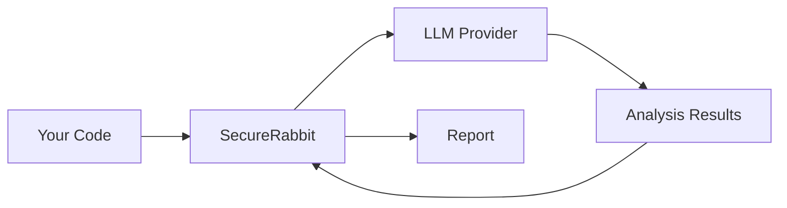

# Security Best Practices

Guidelines for using SecureRabbit securely and responsibly.

## Table of Contents

- [Protecting API Keys](#protecting-api-keys)
- [Handling Sensitive Code](#handling-sensitive-code)
- [Report Security](#report-security)
- [CI/CD Security](#cicd-security)
- [Network Security](#network-security)
- [Data Privacy](#data-privacy)
- [Compliance Considerations](#compliance-considerations)

## Protecting API Keys

### Never Hardcode API Keys

❌ **Don't do this:**
```yaml
# .securerabbit.yml
llm:
  api_key: "sk-proj-abc123..."  # NEVER DO THIS!
```

✅ **Do this instead:**
```yaml
# .securerabbit.yml
llm:
  api_key_env: "OPENAI_API_KEY"
```

```bash
# Set in environment
export OPENAI_API_KEY="sk-proj-abc123..."
```

### Use Environment Variables

```bash
# In your shell profile (~/.bashrc, ~/.zshrc)
export OPENAI_API_KEY="your-key-here"

# Or use a secrets manager
export OPENAI_API_KEY=$(vault read -field=value secret/openai/api_key)

# Or in CI/CD (GitHub Actions example)
# Set as repository secret, then:
env:
  OPENAI_API_KEY: ${{ secrets.OPENAI_API_KEY }}
```

### Rotate Keys Regularly

```bash
# Rotate API keys every 90 days
# 1. Generate new key from provider dashboard
# 2. Update environment variable
export OPENAI_API_KEY="sk-proj-new-key..."
# 3. Test SecureRabbit
securerabbit scan --static-only  # Verify it works
# 4. Delete old key from provider dashboard
```

### Use Separate Keys for Different Environments

```bash
# Development
export OPENAI_API_KEY="sk-proj-dev-..."

# Staging
export OPENAI_API_KEY="sk-proj-staging-..."

# Production
export OPENAI_API_KEY="sk-proj-prod-..."
```

### Restrict Key Permissions

When creating API keys:
- ✅ Use minimum required permissions
- ✅ Set usage limits/quotas
- ✅ Enable IP restrictions if possible
- ✅ Monitor usage regularly

## Handling Sensitive Code

### Be Cautious with Proprietary Code

SecureRabbit sends code snippets to LLM providers for analysis. Consider:

1. **Review what's being sent**
   - Code is sent in chunks for analysis
   - Static findings context is included
   - No secrets should be in code anyway (but double-check)

2. **Use static-only mode for highly sensitive code**
   ```bash
   securerabbit scan --static-only
   ```

3. **Review LLM provider terms**
   - OpenAI: [API Data Usage](https://openai.com/policies/api-data-usage-policies)
   - Anthropic: [Privacy Policy](https://www.anthropic.com/privacy)
   - Google: [Gemini Terms](https://ai.google.dev/terms)

### Sanitize Before Scanning

```bash
# Remove sensitive comments
find . -name "*.go" -exec sed -i '/TODO: REMOVE BEFORE PRODUCTION/d' {} \;

# Then scan
securerabbit scan
```

### Use .gitignore-style Patterns

```yaml
# .securerabbit.yml
ignore:
  - "config/secrets.yaml"
  - "**/*-secret.*"
  - "**/*.key"
  - "**/*.pem"
  - ".env*"
```

### Consider Self-Hosted LLMs

For maximum control:
- Use static-only mode
- Deploy local LLM inference
- Implement custom LLM provider (future feature)

## Report Security

### Secure Report Storage

```bash
# Don't commit reports to Git
echo "securerabbit-report.*" >> .gitignore
echo "security-*.json" >> .gitignore

# Store in secure location
securerabbit scan --output /secure/reports/$(date +%Y%m%d).md

# Or encrypt reports
securerabbit scan --format json | gpg --encrypt > report.json.gpg
```

### Access Control

```bash
# Set restrictive permissions
chmod 600 securerabbit-report.md

# Only owner can read/write
ls -la securerabbit-report.md
# -rw------- 1 user user 12345 Dec 06 10:30 securerabbit-report.md
```

### Share Securely

When sharing reports:
- ✅ Use encrypted channels (encrypted email, secure file sharing)
- ✅ Remove false positives before sharing
- ✅ Redact sensitive paths/information
- ❌ Don't post full reports publicly
- ❌ Don't commit reports to public repos

### Report Retention

```bash
# Auto-delete old reports (example cron job)
# Delete reports older than 30 days
0 0 * * * find /secure/reports -name "*.md" -mtime +30 -delete
```

## CI/CD Security

### Secure Secret Management

#### GitHub Actions

```yaml
name: Security Scan
on: [pull_request]

jobs:
  scan:
    runs-on: ubuntu-latest
    steps:
      - uses: actions/checkout@v2
      
      - name: Security Scan
        env:
          OPENAI_API_KEY: ${{ secrets.OPENAI_API_KEY }}
        run: |
          securerabbit scan --mode diff --static-only
```

**Best practices:**
- Store API keys as repository secrets
- Use environment-specific secrets
- Enable secret scanning
- Audit secret access logs

#### GitLab CI

```yaml
security_scan:
  stage: test
  script:
    - securerabbit scan --static-only
  variables:
    OPENAI_API_KEY: $OPENAI_API_KEY
  only:
    - merge_requests
```

**Best practices:**
- Use protected variables
- Mask sensitive output
- Limit variable scope to specific branches

### Limit Scan Scope in CI

```bash
# Only scan changed files in PRs
securerabbit scan --mode diff

# Only static analysis in public CI
securerabbit scan --static-only

# Deep scans only on protected branches
if [ "$CI_COMMIT_BRANCH" == "main" ]; then
  securerabbit scan --mode deep
else
  securerabbit scan --mode diff --static-only
fi
```

### Audit Trail

```bash
# Log all scans with metadata
securerabbit scan --format json | \
  jq '. + {
    "scanned_by": env.USER,
    "scan_timestamp": now,
    "git_commit": env.CI_COMMIT_SHA
  }' > audit/scan-$(date +%s).json
```

## Network Security

### Verify TLS/SSL

SecureRabbit uses HTTPS for all API calls. Verify:

```bash
# Check LLM provider connectivity
curl -v https://api.openai.com/v1/models \
  -H "Authorization: Bearer $OPENAI_API_KEY" 2>&1 | grep "SSL"
```

### Use Proxies for Corporate Networks

```bash
# Set HTTP proxy
export HTTP_PROXY=http://proxy.company.com:8080
export HTTPS_PROXY=http://proxy.company.com:8080

# Run scan
securerabbit scan
```

### Network Isolation

For sensitive environments:

```bash
# Run in isolated network segment
# Block outbound traffic except to LLM APIs

# Or use static-only mode (no network calls)
securerabbit scan --static-only
```

### Monitor Network Traffic

```bash
# Log all outbound connections
tcpdump -i any -w securerabbit-traffic.pcap 'host api.openai.com'

# Analyze what's being sent
wireshark securerabbit-traffic.pcap
```

## Data Privacy

### Understand Data Flow



**What's sent to LLM:**
- Code snippets (configurable chunk size)
- File paths (for context)
- Static analysis findings (for enrichment)

**What's NOT sent:**
- API keys (unless hardcoded in code - don't do this!)
- Complete codebase
- Git history
- Environment variables

### GDPR Compliance

If your code contains personal data:

1. **Minimize data exposure**
   - Use smart mode (selective analysis)
   - Sanitize test data before scanning

2. **Review provider data policies**
   - Check data retention policies
   - Verify data processing agreements
   - Ensure provider is GDPR-compliant

3. **Document data processing**
   - Maintain records of what's scanned
   - Document legal basis for processing
   - Implement data subject rights

### Data Residency

For specific data residency requirements:

```yaml
# Use providers with regional endpoints
llm:
  provider: "anthropic"  # EU data centers available
  # or
  provider: "openai"     # Supports EU region
```

Or use static-only mode:
```bash
securerabbit scan --static-only  # No data leaves your network
```

## Compliance Considerations

### SOC 2 / ISO 27001

For compliance with security frameworks:

1. **Access Control**
   - Implement least privilege for API keys
   - Log all scan activities
   - Regular access reviews

2. **Change Management**
   - Version control configuration
   - Review config changes
   - Test in non-production first

3. **Monitoring**
   ```bash
   # Log all scans
   securerabbit scan 2>&1 | tee -a /var/log/securerabbit/scan.log
   ```

4. **Incident Response**
   - Have API key revocation procedure
   - Monitor for suspicious activity
   - Regular security assessments

### PCI DSS

If scanning payment card processing code:

1. **Segment networks** - Isolate cardholder data environment
2. **Encrypt reports** - Contain sensitive findings
3. **Access logging** - Audit who runs scans
4. **Use static-only** - Avoid sending code externally

### HIPAA

For healthcare applications:

1. **Business Associate Agreement** - Ensure LLM provider has BAA
2. **Minimize PHI exposure** - Sanitize test data
3. **Encrypt data in transit/rest** - Reports and logs
4. **Access controls** - Restrict who can run scans

## Security Checklist

Before using SecureRabbit in production:

- [ ] API keys stored in environment variables, not config files
- [ ] `.securerabbit.yml` added to version control (without secrets)
- [ ] Reports added to `.gitignore`
- [ ] Understand what data is sent to LLM providers
- [ ] Review LLM provider terms of service
- [ ] Set up secure report storage with access controls
- [ ] Configure appropriate ignore patterns
- [ ] Test static-only mode for sensitive code
- [ ] Enable audit logging
- [ ] Set up API key rotation schedule
- [ ] Configure usage limits on API keys
- [ ] Train team on security best practices
- [ ] Document security procedures
- [ ] Regular security reviews scheduled

## Reporting Security Issues

Found a security vulnerability in SecureRabbit?

**DO NOT open a public issue.**

Instead:
1. Email security@[project-domain] with details
2. Include steps to reproduce
3. Proposed fix if you have one
4. Allow time for response before disclosure

We follow responsible disclosure practices.

## Additional Resources

- [OWASP Secure Coding Practices](https://owasp.org/www-project-secure-coding-practices-quick-reference-guide/)
- [NIST Cybersecurity Framework](https://www.nist.gov/cyberframework)
- [CIS Controls](https://www.cisecurity.org/controls)
- OpenAI [API Data Usage Policy](https://openai.com/policies/api-data-usage-policies)
- Anthropic [Privacy Policy](https://www.anthropic.com/privacy)

## Next Steps

- Read the [Usage Guide](./usage.md)
- Configure [custom rules](./configuration.md)
- Set up [CI/CD integration](./usage.md#cicd-integration)

---

**Security is a shared responsibility. Use SecureRabbit wisely and securely.**

If you have questions about security, please [open a discussion](https://github.com/deepam02/securerabbit/discussions).
